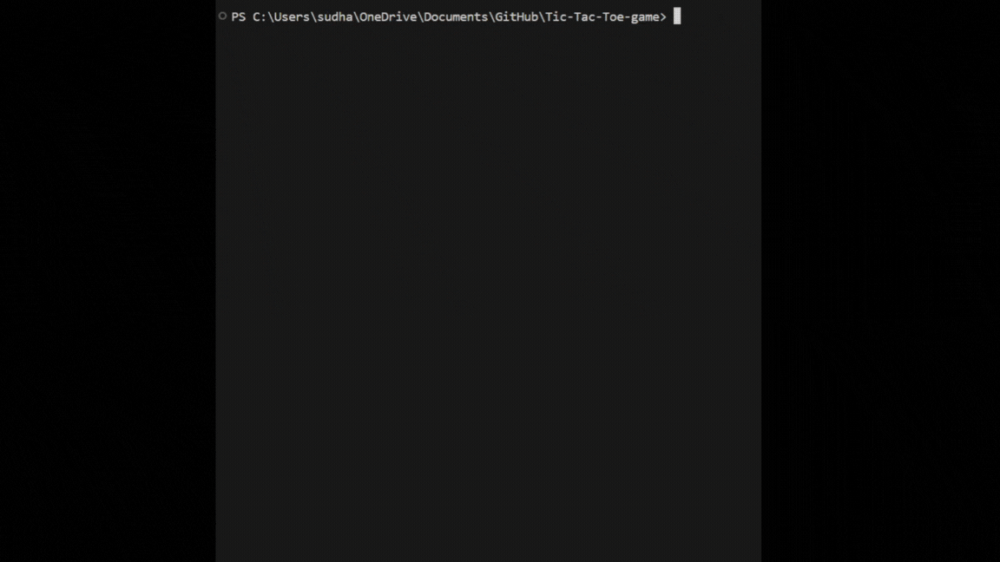

# TikTakToe
This is a simple console-based TikTakToe game implemented in C. The player competes against the computer in a 3x3 grid.

## Preview
<picture></picture>

## How to Play
1. Start the Game: Run the program. You will be prompted to enter your moves.
  
2. Player Move: Enter the row and column numbers (1-3) to place your 'X' on the board.
  
3. Computer Move: The computer will place an 'O' on the board in a random empty position.
  
4. Winning Condition: The first player to align three of their symbols (either 'X' or 'O') horizontally, vertically, or diagonally wins the game.

5. Tie Condition: If all spaces are filled and no player has won, the game ends in a tie.
  
## Functions
- resetBoard(): Initializes or resets the game board.
  
- printBoard(): Displays the current state of the game board.
  
- checkFreeSpaces(): Counts and returns the number of free spaces left on the board.

- playerMove(): Prompts the player to enter their move.
  
- computerMove(): Randomly places a computer move on the board.

- checkWinner(): Checks the board to determine if there's a winner.
printWinner(char winner): Displays the result of the game based on the winner.

## Compilation and Execution
1. To check whether MinGW is recognized by your system, use the following command:
   ```
   gcc -v
   ```
2. use the play button in the top right corner to run and debug the code.

3. To compile the game, use the following command:
   ```
   gcc -o TikTakToe TikTakToe.c
   ```

   To run the compiled program:
   ```
   ./TikTakToe
   ```

   If you encounter any issues setting up MinGW on Windows, refer to this guide: 
   [How to run a C program in Visual Studio Code](https://www.javatpoint.com/how-to-run-a-c-program-in-visual-studio-code)

## Dependencies
Standard C library: 
- [MinGW](https://sourceforge.net/projects/mingw/)
- [C/C++](https://marketplace.visualstudio.com/items?itemName=ms-vscode.cpptools)
